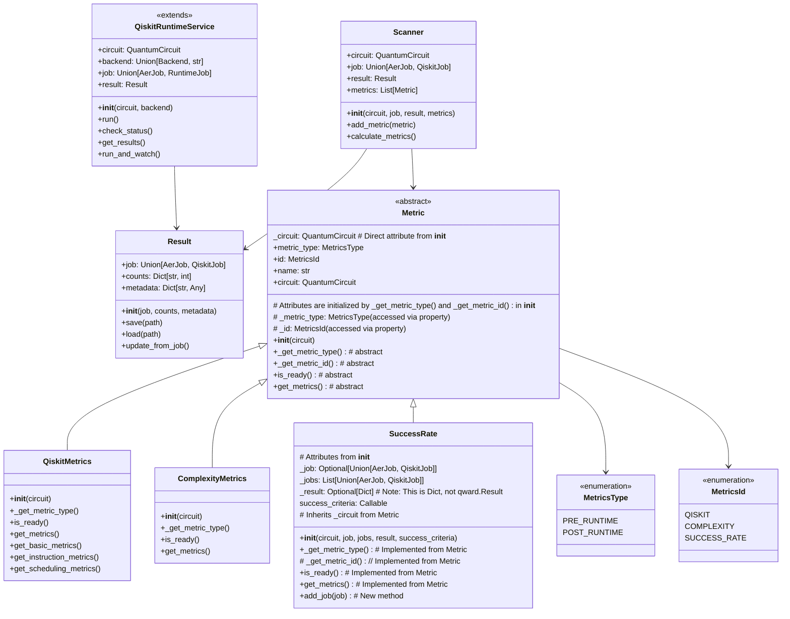

# QWARD Architecture

This document outlines the architecture of the QWARD library and provides usage examples.

## Overview

QWARD is designed with a clear separation between execution and analysis components. The architecture consists of four main components:



## Folder Structure

The QWARD library is organized into the following folder structure:

```
/qward/
├── __init__.py                 # Main package initialization
├── scanner.py                  # Scanner class implementation
├── runtime/
│   ├── __init__.py
│   └── qiskit_runtime.py       # QiskitRuntimeService implementation
├── result.py                   # Result class implementation
├── metrics/
│   ├── __init__.py
│   ├── base_metric.py          # Base Metric class
│   ├── types.py                # MetricsType and MetricsId enums
│   ├── defaults.py             # Default metric configurations
│   ├── qiskit_metrics.py       # QiskitMetrics implementation
│   ├── complexity_metrics.py   # ComplexityMetrics implementation
│   └── success_rate.py         # SuccessRate implementation
├── utils/
│   ├── __init__.py
│   ├── flatten.py              # Utility for flattening nested lists
│   └── helpers.py              # Utility functions
└── examples/
    ├── __init__.py
    ├── utils.py                # Utilities for examples
    ├── run_on_aer.ipynb        # Example notebook for running on Aer simulator
    ├── aer.py                  # Example Aer simulator usage
    └── example_metrics_constructor.py # Example for custom metrics constructor
```

This structure provides a clean organization for the code, with:

1. **Main Package**: Core classes at the top level for easy imports
2. **Runtime Module**: Handles execution of quantum circuits
3. **Metrics Module**: Contains all metric implementations
4. **Utils Module**: Helper functions and utilities
5. **Examples Module**: Working code examples demonstrating library usage

## Components

### Scanner
The Scanner class is the main entry point for analyzing quantum circuits. It can be initialized with a quantum circuit, job, result, and an optional list of metric classes or instances. It allows users to add further metrics and calculate them.

### QiskitRuntimeService
The QiskitRuntimeService class extends Qiskit's `QiskitRuntimeService` class to provide enhanced functionality for quantum circuit execution. It inherits all standard Qiskit runtime capabilities and adds the `run_and_watch` method for improved job monitoring. This class manages the job lifecycle and result collection, providing a streamlined interface for executing circuits on IBM quantum hardware.

### Result
The Result class represents the output of a quantum circuit execution. It includes the job information, measurement counts, and metadata. It provides methods for saving and loading results, as well as updating results from a job.

### Metric
The Metric class is an abstract base class that defines the interface for all metrics. It includes the circuit attribute, properties for metric type and ID, and abstract methods for metric calculation. Concrete implementations include QiskitMetrics, ComplexityMetrics, and SuccessRate. Default metric classes can be obtained using the `get_default_metrics()` function from the `qward.metrics.defaults` module.

### SuccessRate
The SuccessRate class calculates success rate metrics for quantum circuits, such as success rate, fidelity, and error rate. It is initialized with a `QuantumCircuit`, and can optionally take a single `job` or a list of `jobs`, a `result` dictionary (containing counts), and a custom `success_criteria` function. Metrics are calculated based on the execution counts from the provided job(s) or result. Additional jobs can be added using the `add_job` method for aggregate analysis.

## Usage Examples

### Basic Circuit Analysis
```python
from qiskit import QuantumCircuit
from qward import Scanner, QiskitMetrics

# Create a quantum circuit
circuit = QuantumCircuit(2)
circuit.h(0)
circuit.cx(0, 1)

# Create a scanner with the circuit
scanner = Scanner(circuit=circuit)

# Add a metric
scanner.add_metric(QiskitMetrics(circuit))

# Calculate metrics
results = scanner.calculate_metrics()
```

### Running Circuits with QiskitRuntimeService
```python
from qiskit import QuantumCircuit
from qward import QiskitRuntimeService

# Create a quantum circuit
circuit = QuantumCircuit(2)
circuit.h(0)
circuit.cx(0, 1)

# Create a runtime service instance
runtime_service = QiskitRuntimeService(circuit=circuit, backend="ibmq_qasm_simulator")

# Run the circuit with automatic status monitoring
# This will:
# 1. Generate a preset pass manager for the backend
# 2. Create a sampler for the circuit
# 3. Run the circuit and monitor its status
# 4. Return the results when complete
result = runtime_service.run_and_watch()

# Or use the standard approach
runtime_service.run()
status = runtime_service.check_status()
result = runtime_service.get_results()
```

### Analyzing Results
```python
from qward import Scanner, QiskitMetrics, ComplexityMetrics

# Create a scanner with a result
scanner = Scanner(result=result)

# Add multiple metrics
scanner.add_metric(QiskitMetrics(circuit))
scanner.add_metric(ComplexityMetrics(circuit))

# Calculate metrics
results = scanner.calculate_metrics()
```

### Using Custom Metrics
```python
from qward import Metric, MetricsType, MetricsId
from qiskit import QuantumCircuit

class MyCustomMetric(Metric):
    def __init__(self, circuit: QuantumCircuit):
        super().__init__(circuit)
    
    def _get_metric_type(self) -> MetricsType:
        """
        Get the type of this metric.
        
        Returns:
            MetricsType: The type of this metric
        """
        return MetricsType.PRE_RUNTIME

    def _get_metric_id(self) -> MetricsId:
        """
        Get the ID of this metric.
        For custom metrics, you might extend MetricsId or use a general ID.
        Returns:
            MetricsId: The ID of this metric (e.g., reusing an existing one for simplicity)
        """
        return MetricsId.QISKIT
    
    def is_ready(self) -> bool:
        return True
    
    def get_metrics(self) -> dict:
        # Custom metric calculation
        value = 42
        return {"my_metric": value}

# Example usage (assuming 'circuit' is a QuantumCircuit instance)
# circuit = QuantumCircuit(1)
# scanner = Scanner(circuit=circuit)
# scanner.add_metric(MyCustomMetric(circuit))
# results = scanner.calculate_metrics()
# print(results)
```

## Best Practices

1. **Circuit Analysis**
   - Use the Scanner class for all circuit analysis
   - Add metrics before calculating results
   - Consider using multiple metrics for comprehensive analysis

2. **Execution**
   - Use QiskitRuntimeService for IBM backend execution
   - Use run_and_watch() for simplified job monitoring and execution
   - The run_and_watch() method handles:
     - Circuit transpilation with preset pass manager
     - Sampler creation and configuration
     - Job submission and monitoring
     - Result collection and processing
   - Handle job and result errors appropriately

3. **Result Management**
   - Save results for later analysis
   - Include relevant metadata with results
   - Use consistent naming conventions for saved results

4. **Custom Metrics**
   - Inherit from the Metric base class
   - Implement the required abstract methods
   - Return results in a consistent format
   - Document metric calculation methodology 