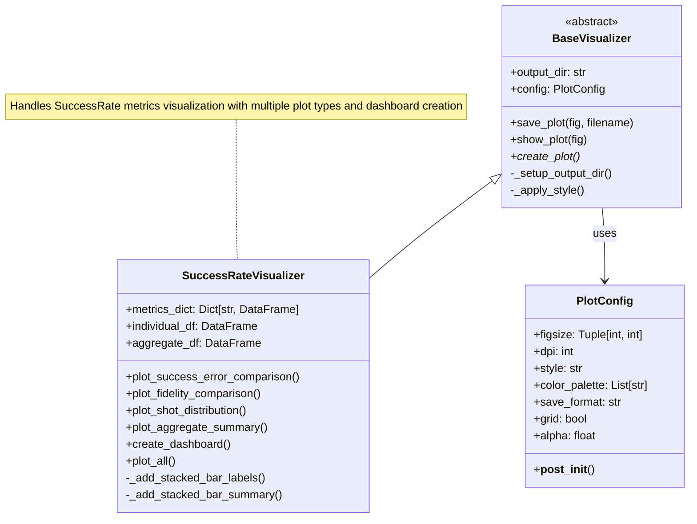

# QWARD Visualization Guide

## Overview

QWARD provides a comprehensive visualization system for quantum circuit metrics. The visualization module follows a clean, object-oriented architecture that makes it easy to create beautiful, informative plots for your quantum computing analysis.

## Architecture

The visualization system is built around a simple but powerful architecture:

- **`PlotConfig`**: A dataclass holding all plot appearance and saving configurations
- **`BaseVisualizer`**: An abstract base class that handles common functionality like output directory management, styling, and plot saving/showing. Subclasses implement `create_plot()` for their specific visualization logic
- **`SuccessRateVisualizer`**: A concrete visualizer that creates various plots for success rate metrics analysis, including individual plots and comprehensive dashboards



## Quick Start

### Basic Usage

```python
from qiskit import QuantumCircuit
from qiskit_aer import AerSimulator
from qward import Scanner
from qward.metrics import SuccessRate
from qward.visualization import SuccessRateVisualizer

# Create a quantum circuit
circuit = QuantumCircuit(2, 2)
circuit.h(0)
circuit.cx(0, 1)
circuit.measure_all()

# Run the circuit
simulator = AerSimulator()
job = simulator.run(circuit, shots=1024)

# Calculate metrics
scanner = Scanner(circuit=circuit)
success_rate = SuccessRate(circuit=circuit, success_criteria=lambda x: x == "11")
success_rate.add_job(job)
scanner.add_strategy(success_rate)

metrics_dict = scanner.calculate_metrics()

# Create visualizations
visualizer = SuccessRateVisualizer(metrics_dict, output_dir="img/my_plots")
figures = visualizer.plot_all(save=True, show=False)
```

### Custom Configuration

```python
from qward.visualization import PlotConfig

# Create custom configuration
custom_config = PlotConfig(
    figsize=(12, 8),
    style="quantum",
    dpi=150,
    save_format="svg",
    color_palette=["#1f77b4", "#ff7f0e", "#2ca02c", "#d62728"]
)

# Use custom configuration
visualizer = SuccessRateVisualizer(
    metrics_dict, 
    output_dir="img/custom_plots",
    config=custom_config
)
```

## Available Visualizers

### SuccessRateVisualizer

The `SuccessRateVisualizer` creates comprehensive visualizations for success rate metrics. It expects metrics data with specific keys:
- `"SuccessRate.individual_jobs"`: DataFrame with individual job metrics
- `"SuccessRate.aggregate"`: DataFrame with aggregate statistics

#### Individual Plots

1. **Success vs Error Rate Comparison**
   ```python
   visualizer.plot_success_error_comparison(save=True, show=True)
   ```
   Shows success and error rates across different jobs as a bar chart.

2. **Fidelity Comparison**
   ```python
   visualizer.plot_fidelity_comparison(save=True, show=True)
   ```
   Displays fidelity values for each job.

3. **Shot Distribution**
   ```python
   visualizer.plot_shot_distribution(save=True, show=True)
   ```
   Shows the distribution of successful vs failed shots as stacked bars with detailed labels.

4. **Aggregate Summary**
   ```python
   visualizer.plot_aggregate_summary(save=True, show=True)
   ```
   Provides a comprehensive summary of aggregate statistics.

#### Dashboard View

Create a comprehensive dashboard with all visualizations in a 2x2 subplot layout:

```python
dashboard_fig = visualizer.create_dashboard(save=True, show=False)
```

#### Plot All

Generate all individual plots at once:

```python
all_figures = visualizer.plot_all(save=True, show=False)
```

## Plot Configuration

### Available Styles

- `"default"`: Standard matplotlib style
- `"quantum"`: Custom quantum-themed style with clean backgrounds and seaborn-inspired appearance
- `"minimal"`: Minimalist style with white grid

### Color Palettes

The default color palette is ColorBrewer-inspired for better accessibility:

```python
default_palette = [
    "#1f77b4",  # Blue
    "#ff7f0e",  # Orange
    "#2ca02c",  # Green
    "#d62728",  # Red
    "#9467bd",  # Purple
    "#8c564b",  # Brown
    "#e377c2",  # Pink
    "#7f7f7f",  # Gray
    "#bcbd22",  # Olive
    "#17becf",  # Cyan
]
```

### Save Formats

Supported formats: `"png"`, `"svg"`, `"pdf"`, `"eps"`

## Advanced Examples

### Multiple Jobs Visualization

```python
# Create multiple jobs with different configurations
jobs = []
for shots in [512, 1024, 2048]:
    job = simulator.run(circuit, shots=shots)
    jobs.append(job)

# Add all jobs to the metric strategy
success_rate_strategy = SuccessRate(circuit=circuit)
for job in jobs:
    success_rate_strategy.add_job(job)

# Visualize results
scanner = Scanner(circuit=circuit)
scanner.add_strategy(success_rate_strategy)
metrics_dict = scanner.calculate_metrics()

visualizer = SuccessRateVisualizer(metrics_dict)
visualizer.plot_all(save=True)
```

### Custom Success Criteria

```python
# Define custom success criteria
def custom_criteria(outcome):
    # Success if we measure |00⟩ or |11⟩ (Bell states)
    return outcome in ["00", "11"]

success_rate = SuccessRate(
    circuit=circuit,
    success_criteria=custom_criteria
)
```

### Dashboard with Custom Configuration

```python
# Create a high-quality dashboard for publication
publication_config = PlotConfig(
    figsize=(16, 12),
    dpi=300,
    style="quantum",
    save_format="svg",
    grid=True,
    alpha=0.8
)

visualizer = SuccessRateVisualizer(
    metrics_dict,
    output_dir="img/publication",
    config=publication_config
)

# Create dashboard
dashboard = visualizer.create_dashboard(save=True, show=False)
```

## Extending the Visualization System

### Creating Custom Visualizers

To create your own visualizer for a custom metric:

```python
from qward.visualization.base import BaseVisualizer
import matplotlib.pyplot as plt
import pandas as pd

class MyCustomVisualizer(BaseVisualizer):
    def __init__(self, metrics_dict, output_dir="img", config=None):
        super().__init__(output_dir, config)
        self.metrics_dict = metrics_dict
        
        # Validate required data
        if "MyCustomMetric.data" not in metrics_dict:
            raise ValueError("Required metric data not found")
        
        self.data_df = metrics_dict["MyCustomMetric.data"]
    
    def create_plot(self):
        """Create the main plot for your metric."""
        fig, ax = plt.subplots(figsize=self.config.figsize)
        
        # Create your visualization
        self.data_df.plot(kind='bar', ax=ax, 
                         color=self.config.color_palette[0],
                         alpha=self.config.alpha)
        
        ax.set_title("My Custom Metric Analysis")
        ax.set_xlabel("Categories")
        ax.set_ylabel("Values")
        
        if self.config.grid:
            ax.grid(True, alpha=0.3)
        
        plt.tight_layout()
        return fig
    
    def plot_custom_analysis(self, save=True, show=True):
        """Create a custom analysis plot."""
        fig = self.create_plot()
        
        if save:
            self.save_plot(fig, "custom_analysis")
        if show:
            self.show_plot(fig)
            
        return fig
```

### Adding New Plot Styles

```python
import matplotlib.pyplot as plt

# Define a custom style
custom_style = {
    "figure.facecolor": "#f0f0f0",
    "axes.facecolor": "#ffffff",
    "axes.edgecolor": "#333333",
    "grid.color": "#cccccc",
    "text.color": "#000000",
}

# Apply custom style
plt.rcParams.update(custom_style)
```

## Data Requirements

### SuccessRateVisualizer Data Format

The `SuccessRateVisualizer` expects specific DataFrame structures:

#### Individual Jobs DataFrame (`"SuccessRate.individual_jobs"`)
Required columns:
- `success_rate`: Success rate (0.0 to 1.0)
- `error_rate`: Error rate (0.0 to 1.0)
- `fidelity`: Fidelity (0.0 to 1.0)
- `total_shots`: Total number of shots
- `successful_shots`: Number of successful shots

#### Aggregate DataFrame (`"SuccessRate.aggregate"`)
Required columns:
- `mean_success_rate`: Mean success rate across jobs
- `std_success_rate`: Standard deviation of success rate
- `min_success_rate`: Minimum success rate
- `max_success_rate`: Maximum success rate
- `fidelity`: Average fidelity
- `error_rate`: Average error rate

## Best Practices

1. **Output Organization**: Use descriptive output directories
   ```python
   from datetime import datetime
   timestamp = datetime.now().strftime("%Y%m%d_%H%M%S")
   visualizer = SuccessRateVisualizer(
       metrics_dict,
       output_dir=f"img/experiment_{timestamp}"
   )
   ```

2. **Batch Processing**: When creating many plots, use `show=False`
   ```python
   figures = visualizer.plot_all(save=True, show=False)
   ```

3. **High-Quality Exports**: For publications, use SVG or PDF
   ```python
   config = PlotConfig(dpi=300, save_format="svg")
   ```

4. **Consistent Styling**: Define a project-wide configuration
   ```python
   PROJECT_PLOT_CONFIG = PlotConfig(
       style="quantum",
       figsize=(10, 6),
       dpi=300,
       save_format="png"
   )
   ```

5. **Memory Management**: For large datasets, close figures explicitly
   ```python
   import matplotlib.pyplot as plt
   
   figures = visualizer.plot_all(save=True, show=False)
   for fig in figures:
       plt.close(fig)  # Free memory immediately
   ```

## Troubleshooting

### Common Issues

1. **Missing Dependencies**
   ```bash
   pip install matplotlib pandas seaborn
   ```

2. **Style Not Found**
   ```python
   import matplotlib.pyplot as plt
   # Check available styles
   print(plt.style.available)
   ```

3. **Data Validation Errors**
   ```python
   # Check your data structure
   print("Available keys:", list(metrics_dict.keys()))
   print("Individual jobs columns:", metrics_dict["SuccessRate.individual_jobs"].columns.tolist())
   print("Aggregate columns:", metrics_dict["SuccessRate.aggregate"].columns.tolist())
   ```

4. **Memory Issues with Large Datasets**
   ```python
   import matplotlib.pyplot as plt
   
   # Process in smaller batches and close figures
   visualizer = SuccessRateVisualizer(metrics_dict)
   fig = visualizer.plot_success_error_comparison(save=True, show=False)
   plt.close(fig)  # Free memory immediately
   ```

## API Reference

### PlotConfig

| Parameter | Type | Default | Description |
|-----------|------|---------|-------------|
| `figsize` | `Tuple[int, int]` | `(10, 6)` | Figure size in inches |
| `dpi` | `int` | `300` | Dots per inch for saved figures |
| `style` | `str` | `"default"` | Plot style ("default", "quantum", "minimal") |
| `color_palette` | `List[str]` | ColorBrewer | List of hex color codes |
| `save_format` | `str` | `"png"` | File format for saving |
| `grid` | `bool` | `True` | Whether to show grid |
| `alpha` | `float` | `0.7` | Transparency level |

### BaseVisualizer Methods

| Method | Parameters | Returns | Description |
|--------|------------|---------|-------------|
| `save_plot` | `fig, filename, **kwargs` | `str` | Save figure and return filepath |
| `show_plot` | `fig` | `None` | Display the figure |
| `create_plot` | - | `plt.Figure` | Abstract method to create plot |

### SuccessRateVisualizer Methods

| Method | Parameters | Returns | Description |
|--------|------------|---------|-------------|
| `plot_all` | `save, show` | `List[plt.Figure]` | Create all available plots |
| `create_dashboard` | `save, show` | `plt.Figure` | Create comprehensive dashboard |
| `plot_success_error_comparison` | `save, show, fig_ax_override` | `plt.Figure` | Compare success vs error rates |
| `plot_fidelity_comparison` | `save, show, fig_ax_override` | `plt.Figure` | Compare fidelity values |
| `plot_shot_distribution` | `save, show, fig_ax_override` | `plt.Figure` | Show shot distribution |
| `plot_aggregate_summary` | `save, show, fig_ax_override` | `plt.Figure` | Create summary visualization |

## See Also

- [Architecture Documentation](architecture.md) - Overall QWARD architecture
- [Technical Documentation](technical_docs.md) - Detailed technical reference
- [Examples Directory](../qward/examples/) - More example scripts