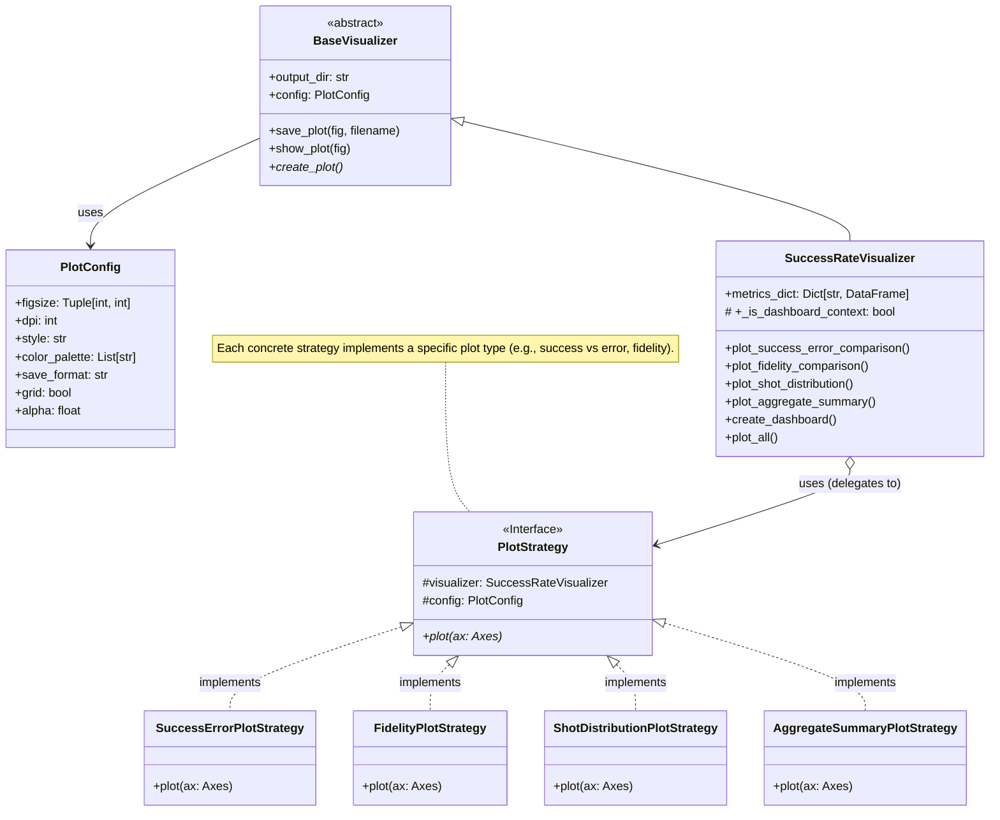

# QWARD Visualization Guide

## Overview

QWARD provides a comprehensive visualization system for quantum circuit metrics. The visualization module follows a modular architecture that makes it easy to create beautiful, informative plots for your quantum computing analysis.

## Architecture

The visualization system follows a structured approach:

- **`PlotConfig`**: A dataclass holding all plot appearance and saving configurations.
- **`BaseVisualizer`**: An abstract base class for all visualizers. It handles common setup (output directory, styling via `PlotConfig`) and provides `save_plot`/`show_plot` methods. Subclasses must implement `create_plot()` for their specific visualization logic.
- **`SuccessRateVisualizer`**: A concrete visualizer inheriting from `BaseVisualizer`. It's responsible for generating various plots related to success rate metrics. Internally, it uses the **Strategy pattern** to manage different types of plots.
- **`PlotStrategy`**: An interface (abstract base class) defining a contract for different plot generation algorithms. Concrete strategies (e.g., `SuccessErrorPlotStrategy`, `FidelityPlotStrategy`) implement this interface to create specific charts. `SuccessRateVisualizer` delegates plotting tasks to these strategies.
- **(Conceptual) `MetricPlottingUtils`**: A utility class or module (not shown in the diagram for simplicity but important for implementation) would contain static helper methods for common tasks related to plotting metric data (e.g., extracting data, validating columns, adding standard labels). Both `SuccessRateVisualizer` and its strategies might use these utilities.



## Quick Start

### Basic Usage

```python
from qiskit import QuantumCircuit
from qiskit_aer import AerSimulator
from qward import Scanner
from qward.metrics import SuccessRate
from qward.visualization import SuccessRateVisualizer

# Create a quantum circuit
circuit = QuantumCircuit(2, 2)
circuit.h(0)
circuit.cx(0, 1)
circuit.measure_all()

# Run the circuit
simulator = AerSimulator()
job = simulator.run(circuit, shots=1024)

# Calculate metrics
scanner = Scanner(circuit=circuit)
success_rate = SuccessRate(circuit=circuit, success_criteria=lambda x: x == "11")
success_rate.add_job(job)
scanner.add_strategy(success_rate)

metrics_dict = scanner.calculate_metrics()

# Create visualizations
visualizer = SuccessRateVisualizer(metrics_dict, output_dir="img/my_plots")
figures = visualizer.plot_all(save=True, show=False)
```

### Custom Configuration

```python
from qward.visualization import PlotConfig

# Create custom configuration
custom_config = PlotConfig(
    figsize=(12, 8),
    style="quantum",
    dpi=150,
    save_format="svg",
    color_palette=["#1f77b4", "#ff7f0e", "#2ca02c", "#d62728"]
)

# Use custom configuration
visualizer = SuccessRateVisualizer(
    metrics_dict, 
    output_dir="img/custom_plots",
    config=custom_config
)
```

## Available Visualizers

### SuccessRateVisualizer

The `SuccessRateVisualizer` creates comprehensive visualizations for success rate metrics:

#### Individual Plots

1. **Success Rate Comparison**
   ```python
   visualizer.plot_success_rate_comparison(save=True)
   ```
   Shows success rates across different jobs with confidence intervals.

2. **Error Rate Comparison**
   ```python
   visualizer.plot_error_rate_comparison(save=True)
   ```
   Displays error rates for each job with visual indicators.

3. **Fidelity Comparison**
   ```python
   visualizer.plot_fidelity_comparison(save=True)
   ```
   Compares fidelity values across jobs.

4. **Shot Distribution**
   ```python
   visualizer.plot_shot_distribution(save=True)
   ```
   Shows the distribution of measurement outcomes.

5. **Aggregate Summary**
   ```python
   visualizer.plot_aggregate_summary(save=True)
   ```
   Provides a comprehensive summary of all metrics.

#### Dashboard View

Create a comprehensive dashboard with all visualizations:

```python
visualizer.create_dashboard(save=True, show=False)
```

## Plot Configuration

### Available Styles

- `"default"`: Standard matplotlib style
- `"quantum"`: Custom quantum-themed style with clean backgrounds
- `"minimal"`: Minimalist style with white grid

### Color Palettes

The default color palette is ColorBrewer-inspired for better accessibility:

```python
default_palette = [
    "#1f77b4",  # Blue
    "#ff7f0e",  # Orange
    "#2ca02c",  # Green
    "#d62728",  # Red
    "#9467bd",  # Purple
    "#8c564b",  # Brown
    "#e377c2",  # Pink
    "#7f7f7f",  # Gray
    "#bcbd22",  # Olive
    "#17becf",  # Cyan
]
```

### Save Formats

Supported formats: `"png"`, `"svg"`, `"pdf"`, `"eps"`

## Advanced Examples

### Multiple Jobs Visualization

```python
# Create multiple jobs with different configurations
jobs = []
for shots in [512, 1024, 2048]:
    job = simulator.run(circuit, shots=shots)
    jobs.append(job)

# Add all jobs to the metric strategy
success_rate_strategy = SuccessRate(circuit=circuit) # Renamed to avoid conflict with a potential 'success_rate' variable from other examples
success_rate_strategy.add_job(jobs)

# Visualize results
scanner = Scanner(circuit=circuit)
scanner.add_strategy(success_rate_strategy)
metrics_dict = scanner.calculate_metrics()

visualizer = SuccessRateVisualizer(metrics_dict)
visualizer.plot_all(save=True)
```

### Custom Success Criteria

```python
# Define custom success criteria
def custom_criteria(outcome):
    # Success if we measure |00⟩ or |11⟩ (Bell states)
    return outcome in ["00", "11"]

success_rate = SuccessRate(
    circuit=circuit,
    success_criteria=custom_criteria
)
```

### Batch Processing

```python
# Ensure create_bell_circuit, create_ghz_circuit, create_qft_circuit are defined
# circuits = [create_bell_circuit(), create_ghz_circuit(), create_qft_circuit()]
# results = {}
# 
# for i, circuit_item in enumerate(circuits): # Renamed 'circuit' to 'circuit_item' to avoid conflict with outer scope 'circuit'
#     scanner = Scanner(circuit=circuit_item)
#     success_rate_calc = SuccessRate(circuit=circuit_item)
#     
#     # Run and add job
#     job = simulator.run(circuit_item, shots=1024)
#     success_rate_calc.add_job(job)
#     scanner.add_strategy(success_rate_calc)
#     
#     # Calculate and visualize
#     metrics = scanner.calculate_metrics()
#     visualizer = SuccessRateVisualizer(
#         metrics, 
#         output_dir=f"img/circuit_{i}"
#     )
#     visualizer.plot_all(save=True, show=False)
#     
#     results[f"circuit_{i}"] = metrics
```

## Extending the Visualization System

### Creating Custom Visualizers

To create your own visualizer for a custom metric:

```python
from qward.visualization.base import MetricVisualizer
import matplotlib.pyplot as plt

class MyCustomVisualizer(MetricVisualizer):
    def create_plot(self):
        """Create the main plot for your metric."""
        fig, ax = plt.subplots(figsize=self.config.figsize)
        
        # Get your metric data
        data = self.get_metric_data("MyCustomMetric")
        
        # Create your visualization
        # ... plotting code ...
        
        return fig
    
    def plot_custom_analysis(self, save=True, show=True):
        """Create a custom analysis plot."""
        fig = self.create_plot()
        
        if save:
            self.save_plot(fig, "custom_analysis")
        if show:
            self.show_plot(fig)
            
        return fig
```

### Adding New Plot Styles

```python
import matplotlib.pyplot as plt # Added import for plt
# Define a custom style
custom_style = {
    "figure.facecolor": "#f0f0f0",
    "axes.facecolor": "#ffffff",
    "axes.edgecolor": "#333333",
    "grid.color": "#cccccc",
    "text.color": "#000000",
}

# Apply custom style
plt.rcParams.update(custom_style)
```

## Best Practices

1. **Output Organization**: Use descriptive output directories. Assume `experiment_name` and `timestamp` are defined.
   ```python
   # experiment_name = "my_experiment"
   # from datetime import datetime
   # timestamp = datetime.now().strftime("%Y%m%d_%H%M%S")
   # visualizer = SuccessRateVisualizer(
   #     metrics_dict,
   #     output_dir=f"img/{experiment_name}/{timestamp}"
   # )
   ```

2. **Batch Processing**: When creating many plots, use `show=False`
   ```python
   figures = visualizer.plot_all(save=True, show=False)
   ```

3. **High-Quality Exports**: For publications, use SVG or PDF
   ```python
   config = PlotConfig(dpi=300, save_format="svg")
   ```

4. **Consistent Styling**: Define a project-wide configuration
   ```python
   # In a config.py file, for example:
   # from qward.visualization import PlotConfig # Added import
   # PROJECT_PLOT_CONFIG = PlotConfig(
   #     style="quantum",
   #     figsize=(10, 6),
   #     dpi=300
   # )
   ```

## Troubleshooting

### Common Issues

1. **Missing Dependencies**
   ```bash
   pip install matplotlib pandas seaborn
   ```

2. **Style Not Found**
   ```python
   import matplotlib.pyplot as plt # Added import for plt
   # Check available styles
   print(plt.style.available)
   ```

3. **Memory Issues with Large Datasets**
   ```python
   import matplotlib.pyplot as plt # Added import for plt
   # Process in batches
   # Assume data_batches is defined, e.g., a list of metric_dicts
   # for batch_metrics_dict in data_batches:
   #     visualizer = SuccessRateVisualizer(batch_metrics_dict)
   #     visualizer.plot_all(save=True, show=False)
   #     plt.close('all')  # Free memory
   ```

## API Reference

### PlotConfig

| Parameter | Type | Default | Description |
|-----------|------|---------|-------------|
| `figsize` | `Tuple[int, int]` | `(10, 6)` | Figure size in inches |
| `dpi` | `int` | `300` | Dots per inch for saved figures |
| `style` | `str` | `"default"` | Plot style ("default", "quantum", "minimal") |
| `color_palette` | `List[str]` | ColorBrewer | List of hex color codes |
| `save_format` | `str` | `"png"` | File format for saving |
| `grid` | `bool` | `True` | Whether to show grid |
| `alpha` | `float` | `0.7` | Transparency level |

### BaseVisualizer Methods

| Method | Parameters | Returns | Description |
|--------|------------|---------|-------------|
| `save_plot` | `fig, filename, **kwargs` | `str` | Save figure and return filepath |
| `show_plot` | `fig` | `None` | Display the figure |
| `create_plot` | - | `plt.Figure` | Abstract method to create plot |

### SuccessRateVisualizer Methods

| Method | Parameters | Returns | Description |
|--------|------------|---------|-------------|
| `plot_all` | `save, show` | `List[plt.Figure]` | Create all available plots |
| `create_dashboard` | `save, show` | `plt.Figure` | Create comprehensive dashboard |
| `plot_success_rate_comparison` | `save, show` | `plt.Figure` | Compare success rates |
| `plot_error_rate_comparison` | `save, show` | `plt.Figure` | Compare error rates |
| `plot_fidelity_comparison` | `save, show` | `plt.Figure` | Compare fidelity values |
| `plot_shot_distribution` | `save, show` | `plt.Figure` | Show measurement distribution |
| `plot_aggregate_summary` | `save, show` | `plt.Figure` | Create summary visualization |

## See Also

- [Architecture Documentation](architecture.md) - Overall QWARD architecture
- [Technical Documentation](technical_docs.md) - Detailed technical reference
- [Examples Directory](../qward/examples/) - More example scripts