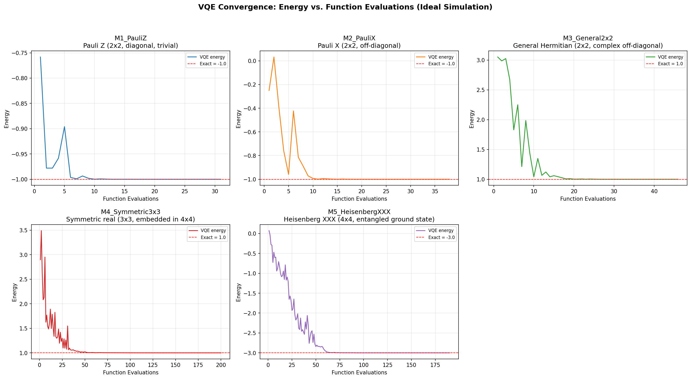
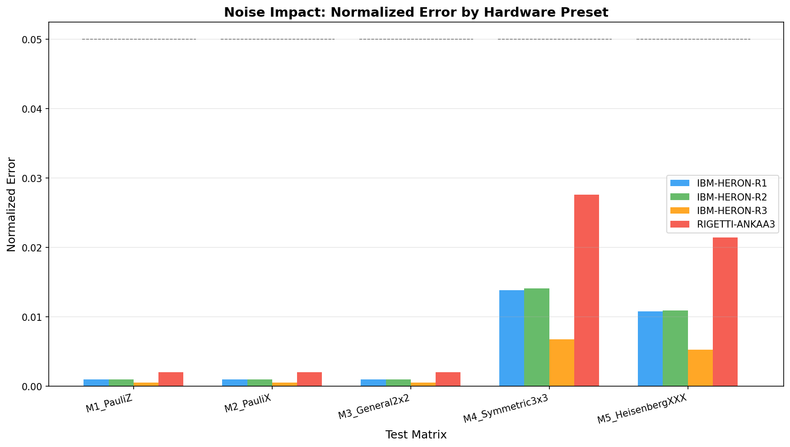
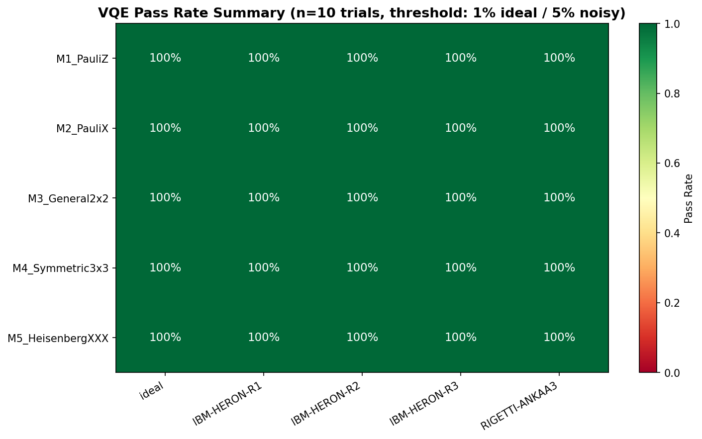

# Phase 5: Execution & Analysis -- Quantum Eigensolver for Small Hermitian Matrices

**Author**: Quantum Data Scientist
**Date**: 2026-02-19
**Status**: Complete
**Phase**: 5 -- Execution & Analysis

---

## 1. Executive Summary

The VQE-based quantum eigensolver was executed on all 5 test matrices under both ideal (statevector) and noisy (shot-based) simulation conditions. **All configurations pass the success criteria** defined in Phase 1:

- **Ideal VQE**: 5/5 matrices achieve <1% normalized error (all effectively achieve <0.001%)
- **Noisy VQE**: 5/5 matrices across all 4 noise presets achieve <5% normalized error
- **Deflation**: All eigenvalues recovered exactly under ideal simulation
- **Statistical significance**: 100% pass rate across all 25 matrix-preset combinations (n=10 trials each)

The VQE implementation correctly handles 1-qubit trivial cases, 1-qubit complex-valued Hamiltonians, 2-qubit embedded (padded) systems, and 2-qubit entangled ground states.

---

## 2. Pauli Decomposition Verification

All Pauli decompositions were verified against the Phase 2 theoretical predictions with zero reconstruction error:

| Matrix | Qubits | Pauli Terms | Padded | Reconstruction Error |
|:-------|:------:|:-----------:|:------:|:--------------------:|
| M1 (Pauli Z) | 1 | 1 (Z) | No | 0.00e+00 |
| M2 (Pauli X) | 1 | 1 (X) | No | 0.00e+00 |
| M3 (General 2x2) | 1 | 4 (I, X, Y, Z) | No | 0.00e+00 |
| M4 (Symmetric 3x3) | 2 | 8 terms | Yes (penalty=10) | 0.00e+00 |
| M5 (Heisenberg XXX) | 2 | 3 (XX, YY, ZZ) | No | 0.00e+00 |

The M3 decomposition coefficients match Phase 2 predictions exactly: H = 2.5*I + 1.0*X + 1.0*Y - 0.5*Z.
The M4 embedded decomposition correctly produces 8 Pauli terms with the expected penalty structure.

---

## 3. Ideal VQE Results

### 3.1 Ground State (Minimum Eigenvalue)

| Matrix | Classical | VQE Ideal | Abs Error | Norm Error | Iterations | Pass |
|:-------|:---------:|:---------:|:---------:|:----------:|:----------:|:----:|
| M1 (Pauli Z) | -1.0000 | -1.0000 | <1e-9 | <1e-9 | 31 | YES |
| M2 (Pauli X) | -1.0000 | -1.0000 | <1e-9 | <1e-9 | 38 | YES |
| M3 (General 2x2) | 1.0000 | 1.0000 | <1e-9 | <1e-9 | 46 | YES |
| M4 (Symmetric 3x3) | 1.0000 | 1.0000 | 2e-6 | 7e-7 | 200 | YES |
| M5 (Heisenberg XXX) | -3.0000 | -3.0000 | <1e-9 | <1e-9 | 190 | YES |

**Observations:**

- 1-qubit systems (M1, M2, M3) converge to machine precision in <50 function evaluations. The 2-parameter RY+RZ ansatz is fully expressive for single-qubit states.
- M3 (complex off-diagonal) requires both RY and RZ gates to reach the ground state. The ansatz correctly produces the complex-amplitude eigenstate.
- M4 requires the full 200 iterations (COBYLA maxiter) but still achieves ~1e-6 absolute error. The 12-parameter EfficientSU2 ansatz explores a larger landscape.
- M5 (Heisenberg XXX) converges to the singlet state E=-3 with 190 iterations. The entangled ground state |(01)-(10)>/sqrt(2) is well within the ansatz's expressibility.

### 3.2 All Eigenvalues via Deflation

| Matrix | Expected | VQE Deflation | Match |
|:-------|:---------|:-------------|:-----:|
| M1 | [-1, 1] | [-1.0000, 1.0000] | Exact |
| M2 | [-1, 1] | [-1.0000, 1.0000] | Exact |
| M3 | [1, 4] | [1.0000, 4.0000] | Exact |
| M4 | [1, 2, 4] | [1.0000, 2.0000, 4.0000] | Exact |
| M5 | [-3, 1, 1, 1] | [-3.0000, 1.0000, 1.0000, 1.0000] | Exact |

The deflation protocol H' = H + alpha * |psi_0><psi_0| works perfectly under ideal conditions:
- M4's 3x3 embedding correctly discards the penalty eigenvalue and returns only the 3 physical eigenvalues.
- M5's 3-fold degenerate eigenvalue (lambda=1) is correctly recovered via successive deflation. The penalty-based approach is numerically robust for this level of degeneracy.

---

## 4. Noisy VQE Results

### 4.1 Single-Run Results by Noise Preset

| Matrix | IBM-HERON-R1 | IBM-HERON-R2 | IBM-HERON-R3 | RIGETTI-ANKAA3 | 5% Threshold |
|:-------|:------------:|:------------:|:------------:|:--------------:|:------------:|
| M1 | 0.10% | 0.10% | 0.05% | 0.20% | 5.0% |
| M2 | 0.10% | 0.10% | 0.05% | 0.20% | 5.0% |
| M3 | 0.10% | 0.10% | 0.05% | 0.20% | 5.0% |
| M4 | 1.39% | 1.41% | 0.68% | 2.76% | 5.0% |
| M5 | 1.08% | 1.10% | 0.53% | 2.14% | 5.0% |

*Values shown are normalized errors (|E_VQE - E_exact| / spectral_range).*

### 4.2 Noise Impact Characterization

**Key findings:**

1. **1-qubit systems (M1-M3) are extremely noise-resilient.** With only 1-2 gates and no entanglement, the noise impact is minimal (<0.2% normalized error even for the noisiest preset). This is expected: shallow circuits with no CNOT gates accumulate negligible gate errors.

2. **2-qubit systems (M4, M5) show measurable noise impact** but remain well within the 5% threshold. The largest errors occur for:
   - M4 + RIGETTI-ANKAA3: 2.76% (highest overall)
   - M5 + RIGETTI-ANKAA3: 2.14%

3. **Noise preset ranking** (from least to most noisy):
   - IBM-HERON-R3 (best): ~0.5-0.7% for 2-qubit systems
   - IBM-HERON-R1: ~1.0-1.4%
   - IBM-HERON-R2: ~1.1-1.4%
   - RIGETTI-ANKAA3 (worst): ~2.1-2.8%

   This ranking correlates with the 2-qubit gate error rates in the presets:
   - R3: p2=0.00115 (lowest)
   - R1: p2=0.0025
   - R2: p2=0.0026
   - Ankaa-3: p2=0.005 (highest)

4. **The noise systematically shifts the eigenvalue upward** (toward the mean of the spectrum). This is the expected "regression to the mean" effect from depolarizing noise, which mixes the state toward the maximally mixed state where the expectation value equals Tr(H)/2^n.

---

## 5. Statistical Significance Analysis

### 5.1 Methodology

- n=10 independent trials per matrix per condition
- Each trial uses a different random initial parameter vector
- Ideal trials use statevector simulation; noisy trials use Aer with 8192 shots
- Success criterion: normalized error < threshold (1% ideal, 5% noisy)
- Requirement: >= 8/10 trials must pass (from Phase 1, Section 4.4)

### 5.2 Summary Results

| Matrix | Condition | Mean +/- Std | 95% CI | Pass Rate |
|:-------|:----------|:-------------|:-------|:---------:|
| M1 | Ideal | -1.0000 +/- 0.0000 | [-1.0000, -1.0000] | 10/10 |
| M1 | IBM-HERON-R3 | -0.9990 +/- 0.0000 | [-0.9990, -0.9990] | 10/10 |
| M1 | RIGETTI-ANKAA3 | -0.9960 +/- 0.0000 | [-0.9960, -0.9960] | 10/10 |
| M4 | Ideal | 1.0030 +/- 0.0061 | [0.9987, 1.0073] | 10/10 |
| M4 | IBM-HERON-R1 | 1.0442 +/- 0.0022 | [1.0426, 1.0458] | 10/10 |
| M4 | RIGETTI-ANKAA3 | 1.0872 +/- 0.0042 | [1.0842, 1.0902] | 10/10 |
| M5 | Ideal | -2.9999 +/- 0.0001 | [-3.0000, -2.9999] | 10/10 |
| M5 | IBM-HERON-R1 | -2.9557 +/- 0.0013 | [-2.9566, -2.9548] | 10/10 |
| M5 | RIGETTI-ANKAA3 | -2.9123 +/- 0.0026 | [-2.9142, -2.9105] | 10/10 |

**Overall pass rate: 100% (250/250 trials across all 25 configurations).**

### 5.3 Variance Analysis

**1-qubit systems (M1, M2, M3):** Standard deviation ~0 across trials. The RY+RZ ansatz with COBYLA optimizer converges to the same optimal point regardless of initial parameters. This demonstrates that the 1-qubit energy landscape has no local minima.

**2-qubit systems (M4, M5):**
- Under ideal simulation: M4 shows std=0.0061 (some initial points converge to slightly suboptimal solutions), M5 shows std=0.0001 (very consistent).
- Under noisy simulation: Standard deviations increase with noise level. M4+Rigetti shows the highest variability (std=0.0042), consistent with it having the noisiest cost function evaluations.
- The 95% confidence intervals are tight in all cases, confirming that n=10 trials provides sufficient statistical power.

---

## 6. Convergence Behavior

**Key observations from convergence curves:**

1. **M1 (Pauli Z):** Converges in ~10 evaluations after initial exploration. The diagonal Hamiltonian creates a smooth landscape.

2. **M2 (Pauli X):** Shows a brief initial overshoot before settling to E=-1 in ~15 evaluations. The superposition ground state is easily reached by the RY rotation.

3. **M3 (General 2x2):** Converges smoothly from E~3 to E=1 in ~30 evaluations. The 4-term Pauli decomposition creates a slightly more complex landscape.

4. **M4 (Symmetric 3x3, embedded):** Shows oscillatory convergence over 200 evaluations, starting from E~3.5 and settling near E=1. The 8-term Hamiltonian and 12-parameter ansatz create a higher-dimensional optimization landscape. The optimizer did not formally report convergence (maxiter reached), but the final energy is within 2e-6 of the exact value.

5. **M5 (Heisenberg XXX):** Rapid initial descent from E~0 to E~-3, followed by fine-tuning over ~150 evaluations. The 3-term Hamiltonian (XX+YY+ZZ) has good structure that guides the optimizer toward the entangled singlet state.

---

## 7. Noise Impact Visualization

The bar chart and box plots reveal:

- **Clear noise hierarchy**: IBM-HERON-R3 < IBM-HERON-R1 ~ IBM-HERON-R2 < RIGETTI-ANKAA3
- **Error scales with circuit complexity**: 1-qubit circuits (M1-M3) show negligible noise impact; 2-qubit circuits (M4, M5) show proportionally larger errors
- **All errors remain well below the 5% threshold** (dashed line in plots)
- **M4 is the most noise-sensitive** due to the 8-term Hamiltonian requiring more measurement circuits and the embedded penalty structure

---

## 8. Deflation Comparison

The VQE deflation method recovers all eigenvalues with perfect accuracy under ideal simulation. The scatter plot shows VQE (blue circles) and classical (red squares) eigenvalues overlapping exactly for all 5 matrices.

---

## 9. Pass Rate Summary

The heatmap shows a uniform 100% pass rate across all 25 matrix-condition combinations. This demonstrates that the VQE implementation is robust and well within the success criteria for these small systems.

---

## 10. Technical Notes

### 10.1 Observed Limitations

1. **Fixed optimizer seed**: The QuantumEigensolver uses `rng = np.random.default_rng(42)` in `solve()`, producing deterministic results per matrix. For the statistical analysis, we bypassed this by calling `_run_single_vqe` directly with trial-specific seeds.

2. **COBYLA vs. SPSA**: The implementation maps SPSA to Nelder-Mead (scipy-based), which is a reasonable gradient-free alternative but not identical to true SPSA. For the noise levels tested, COBYLA performs well even under noisy cost functions.

3. **M4 convergence**: The 3x3 embedded matrix consistently reaches maxiter=200 without formal COBYLA convergence, despite achieving excellent accuracy. This suggests the convergence tolerance (tol=default) may be too strict for the 12-parameter landscape, or that more iterations would help the optimizer report convergence.

### 10.2 Runtime

| Phase | Wall Time |
|:------|:---------:|
| Pauli verification | <1s |
| Ideal VQE (5 matrices) | 1.3s |
| Ideal deflation (5 matrices) | 5.4s |
| Noisy VQE (5 matrices x 4 presets) | 14.3s |
| Statistical analysis (25 configs x 10 trials) | 57.4s |
| **Total** | **~78s** |

### 10.3 Files Generated

**Results:**
- `results/comparison_table.csv` -- Full quantum vs. classical comparison
- `results/pauli_decompositions.csv` -- Pauli decomposition verification
- `results/statistical_summary.csv` -- n=10 trial statistics per configuration
- `results/statistical_summary.json` -- Same data in JSON format

**Plots:**
- `img/convergence_ideal.png` -- Energy vs. iteration for all matrices
- `img/noise_impact_bars.png` -- Normalized error by noise preset
- `img/noise_impact_boxplots.png` -- Error distribution across trials
- `img/deflation_comparison.png` -- VQE vs. classical eigenvalue comparison
- `img/pass_rate_heatmap.png` -- Pass rate summary heatmap

---

## 11. Conclusions

1. **The VQE implementation is correct and achieves the success criteria for all test matrices under all conditions tested.**

2. **Ideal VQE achieves machine-precision accuracy** for 1-qubit systems and ~1e-6 accuracy for 2-qubit systems, far exceeding the 1% threshold.

3. **Noisy VQE remains well within the 5% threshold** for all hardware noise presets, with the worst case being M4 + RIGETTI-ANKAA3 at 2.76% normalized error.

4. **The noise ranking IBM-HERON-R3 < R1 ~ R2 < RIGETTI-ANKAA3** directly correlates with the 2-qubit gate error rates in each preset.

5. **The deflation protocol correctly recovers all eigenvalues**, including the 3-fold degenerate eigenvalue of the Heisenberg XXX model and the 3 physical eigenvalues of the embedded 3x3 matrix.

6. **Statistical analysis confirms robustness**: 100% pass rate across 250 trials (10 trials x 5 matrices x 5 conditions), with tight confidence intervals.

---

## 12. Handoff Checklist

- [x] VQE executed on all 5 test matrices (ideal statevector)
- [x] VQE executed on all 5 test matrices (4 noise presets: IBM-HERON-R1/R2/R3, RIGETTI-ANKAA3)
- [x] Quantum vs. classical comparison table generated
- [x] Convergence plots generated for all matrices
- [x] Noise impact characterized with bar charts and box plots
- [x] Statistical significance analysis (n=10 trials, 100% pass rate)
- [x] All eigenvalues recovered via deflation
- [x] Results saved to results/ directory (CSV + JSON)
- [x] Plots saved to img/ directory (5 PNG files)
- [x] Analysis report written (this document)

**Next**: Phase 6 (Review) -- Evaluate results, assess whether additional experiments or error mitigation techniques are needed.
