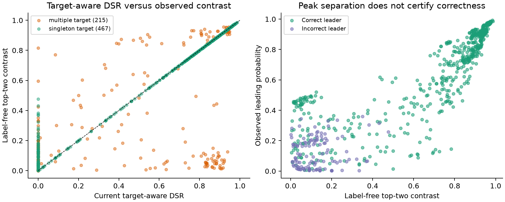
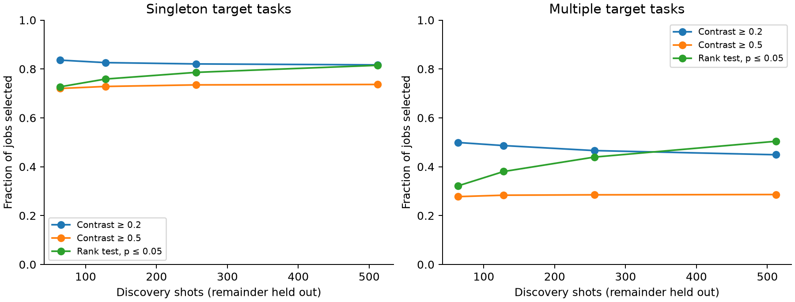

# Formulation and two-step evaluation study

Research note, 9 September 2026. The manuscript, source CSV, existing figures, and metric APIs were not edited. This directory contains the analysis and its reproducible outputs.

**Recommendation: retain Michelson as the relative separation measure, add an established finite-shot rank test as a companion, and keep application verification as a distinct second step.** The data support prioritizing a candidate when a single answer is sought. They do not support automatically discarding every low-contrast histogram, certifying correctness from a peak, or assessing a random-number generator from its top two bins.

## 1. Is another formulation better?

Let the two largest observed counts be \(n_1\ge n_2\), with \(S\) shots. Define

\[
C=\frac{n_1-n_2}{n_1+n_2},\qquad
q=\frac{n_1+n_2}{S},\qquad
\Delta=\frac{n_1-n_2}{S}=Cq.
\]

Here \(C\) measures relative separation within the leading pair, \(q\) measures how much of the histogram that pair occupies, and \(\Delta\) is the absolute probability gap. Changing which outcomes enter the comparison is a substantive change; changing its normalization often is not.

| Candidate | Relationship to Michelson | What changes? |
| --- | --- | --- |
| Leading/runner-up ratio \(r=n_1/n_2\) | \(r=(1+C)/(1-C)\) | Same ordering; infinite when the runner-up count is zero. |
| Pair share \(n_1/(n_1+n_2)\) | \((1+C)/2\) | Same ordering and matched-threshold decisions. |
| Normalized margin \((n_1-n_2)/n_1\) | \(2C/(1+C)\) | Same ordering and matched-threshold decisions. |
| Log ratio | \(\log r=2\operatorname{atanh}(C)\) | Same ordering, with an infinite endpoint. |
| Absolute gap \(\Delta\) | \(Cq\) | Adds information about probability mass; can penalize small but relatively distinct peaks. |
| Exact rank-test p-value | Depends on both \(C\) and \(n_1+n_2\) | Adds evidence about whether finite-shot fluctuations explain the apparent winner. |

For example, Michelson cutoffs 0.2, 0.5, and 0.8 correspond to leading/runner-up ratios 1.5, 3, and 9. Comparing these formulations at the same *numeric* cutoff would compare different decisions. Algebra and matched-threshold decisions were checked against all 1,478 histograms, allowing floating-point tolerance at exact boundaries. No replacement ratio provides an extra ranking signal.

The useful addition is **rank verification**. For the observed winner and runner-up, compute

\[
p_{\mathrm{rank}}=\min\left\{1,\;2\Pr\left[\operatorname{Binomial}(n_1+n_2,1/2)\ge n_1\right]\right\}.
\]

Hung and Fithian justify the two-sided winner-versus-runner-up test for multinomial observations even though the ranks are selected from the same data. This is not the naive post-selection one-sided test. The implementation uses the conservative, nonrandomized exact test. Under the fixed-shot IID multinomial model, it controls erroneous rank declarations at the selected per-job significance level; it does not certify that the winner is an algorithmically correct answer. [Rank Verification for Exponential Families, §§1.1–1.2](https://arxiv.org/pdf/1610.03944).

Counts (12, 4) and (120, 40) both give \(C=0.5\), but their rank-test p-values are 0.0768 and \(1.75\times10^{-10}\). That is a meaningful distinction a rescaled contrast cannot make. Conversely, more shots can establish a *wrong* mode more convincingly. A smaller p-value is not a larger probability of computational success.

I recommend reporting the candidate, \(C\), the two counts, total shots, and the rank-test result. Leading probability is immediately available from these counts. There is no demonstrated reason to compress everything into a new composite scalar. The 0.05 significance level and contrast cutoffs below are exploratory operating points, not fitted universal acceptance rules.

## 2. Closest prior work and contribution boundary

| Work | Closest overlap | Consequence for this paper |
| --- | --- | --- |
| [Tannu and Qureshi, MICRO 2019, §4.3](https://memlab.ece.gatech.edu/papers/MICRO_2019_2.pdf) | Inference Strength (IST): correct-output probability divided by the most frequent wrong-output probability. | Target-versus-competitor separation predates DSR. |
| [Oliveira et al., QuFI, 2022 preprint, §IV-A, Eqs. 1–2](https://arxiv.org/pdf/2203.07183) | Michelson between the correct outcome and strongest wrong outcome; QVF is an affine reversal. Multiple correct outcomes can be summed. | Singleton DSR is \(\max(0,1-2\mathrm{QVF})\). Michelson in quantum-output evaluation is not a new contribution. |
| [Brieger et al., 2026 preprint, §IV](https://arxiv.org/pdf/2605.25983) | Peak Identification plus exactly the top-two Michelson formula, called Relative Peakedness, evaluated after successful identification of the known target. | Cite the direct overlap. Reversing the order to screening then verification is an operational distinction, insufficient alone to establish novelty. |
| [Micklitz, 2025 preprint](https://arxiv.org/abs/2510.13026) | Simulation-free fidelity estimation using quantum-output order statistics. | Relevant related work, but its chaotic-circuit/distribution assumptions do not make it a general fidelity baseline for the structured circuits here. |

For the current multi-target DSR, let \(a=P(E)\), \(K=|E|\), and \(b=\max_{x\notin E}P(x)\). Then

\[
\mathrm{DSR}=\max\left(0,\frac{a-Kb}{a+Kb}\right).
\]

If \(r=a/b\), this becomes \(\max(0,(r-K)/(r+K))\). Thus the important design decision relative to summed-target contrast is dividing target mass by \(K\), not inventing a different contrast family. At fixed \(K\), the signed formulations are monotone transformations; varying \(K\) changes the comparison, and clipping merges all negative margins at zero. The paper can contribute an empirical account of when these choices help or mislead, with explicit operational decisions and limitations. It should not claim a newly invented peak-separation formula or established superiority over existing measures.

## 3. Dataset and method

- All 1,478 records in `../DSR_result.csv` were audited and recomputed with the canonical QWARD Michelson implementation.
- Main cohort: 682 hardware runs—248 Grover, 239 QFT, 165 BV, and 30 BV signal/background. There are 467 singleton-target and 215 multiple-target runs across 67 algorithm/configuration groups. Of these runs, 678 use 1,024 shots, three use 4,096, and one uses 128.
- Separate cohort: 792 teleportation hardware runs, including 116 with only 10 shots, 675 with 4,096, and one with 3,979. Four teleportation simulator records are tabulated separately and excluded from hardware claims.
- Output-register alignment follows the existing extraction: QFT drops extra rightmost ancilla bits in 16 runs; teleportation keeps the rightmost payload bits in 72 runs. Register metadata is necessary even for label-free screening. Here its width is recovered from the stored target-bitstring width; the target identities and number of targets never enter `screen()`.
- Every histogram sums to its declared shots. Recomputed DSR matches all stored values within \(5.01\times10^{-7}\), consistent with six-decimal CSV rounding. The initially observed teleportation discrepancy disappeared after following its distinct register convention; it is not an established source-data defect.
- Stage 1 uses only counts. Stage 2 checks whether the selected candidate belongs to the stored expected-outcome set. This tests *candidate correctness*, not full-distribution correctness or recovery of every valid answer. No ideal-state simulation is run.
- Tied leaders are handled without favoring the all-zero state: full-data summaries use expected correctness under uniform random tie-breaking. Every contrast/rank gate in the tables below requires a unique observed leader. `row_id` is the zero-based CSV record index, excluding its header.

All full-data results are descriptive. Cutoffs were not optimized against labels; nevertheless, this is one existing dataset, not independent validation of a deployment rule. Backend, algorithm, shot-count, and configuration summaries are included to expose composition effects. Macro summaries give each configuration equal weight and report how many configurations have any selected jobs. No significance comparison of differently scaled scores is used.

## 4. Full-data two-step results

“Selected” means forwarded to application verification; “correct” means its leading bitstring is in the known target set.

| Main cohort | Stage-1 policy | Selected | Correct / selected | Correct unique leaders deferred |
| --- | --- | ---: | ---: | ---: |
| Singleton, 467 runs | Inspect every unique leader | 465 | 387 / 465 (83.2%) | 0 |
| Singleton | \(C\ge0.2\) | 381 | 367 / 381 (96.3%) | 20 |
| Singleton | \(C\ge0.5\) | 344 | 344 / 344 (100%) | 43 |
| Singleton | Rank \(p\le0.05\) | 399 | 372 / 399 (93.2%) | 15 |
| Multiple targets, 215 runs | Inspect every unique leader | 206 | 160 / 206 (77.7%) | 0 |
| Multiple targets | \(C\ge0.2\) | 96 | 86 / 96 (89.6%) | 74 |
| Multiple targets | \(C\ge0.5\) | 62 | 62 / 62 (100%) | 98 |
| Multiple targets | Rank \(p\le0.05\) | 125 | 110 / 125 (88.0%) | 50 |

The cutoff \(C\ge0.5\) forwards 406 of 682 runs (59.5%); all selected candidates are correct in this cohort. It also defers 141 of the 547 correct unique leaders (25.8%). The CSV summaries include the additional 0.25 expected correct candidate among tied multi-target runs; the table deliberately uses only unique leaders for the deferred baseline.

This apparent 100% does **not** transfer universally. In teleportation hardware, the same cutoff forwards 29 runs: 25 correct, four wrong. All four wrong selections occur in the 10-shot subset. The rank test forwards 380 teleportation runs: 195 correct, 185 wrong. Those 185 wrong selections occur in the 4,096-shot subset: abundant measurement evidence can establish a wrong leading output. Among main-cohort runs with at least 20 output bits, rank screening forwards 24 of 63 runs, of which only 15 candidates are correct. The second step remains necessary at larger widths too.

For comparison, the absolute-gap rule \(\Delta\ge0.05\) selects 373 singleton runs with 362 correct (97.1%), and 120 multi-target runs with 108 correct (90%). These operating points are not matched for coverage or error. They show a different mass/separation tradeoff, not a validated improvement over Michelson.

The combined rule \(C\ge0.2\) and rank \(p\le0.05\) leaves singleton selection unchanged but reduces multi-target selection from 96 to 89 while retaining the same 86 correct candidates. In this cohort, the statistical check removes seven wrong low-evidence selections. It is still not a correctness test.



## 5. Does an early screen survive a shot split?

For each of the 678 main-cohort runs with 1,024 shots, sample 64, 128, 256, or 512 discovery shots **without replacement**, 30 times using a fixed seed. Compute the candidate and screen from discovery counts alone. Use the remaining shots to measure whether that candidate remains the unique leading outcome. Check target membership separately as the application-level verification.

The repetitions are sensitivity analyses of the same observed jobs, not 81,360 new QPU experiments. Random splits assume exchangeable shots and cannot test device drift. No shot order is available. The study does not measure saved execution time or verification cost, and it does not validate repeatedly testing a live stream until it passes.

| 64-shot discovery | Policy | Mean jobs selected | Correct candidates among selected | Candidate remains unique leader in 960 held-out shots |
| --- | --- | ---: | ---: | ---: |
| Singleton, 463 jobs | \(C\ge0.2\) | 387.2 | 92.5% | 95.8% |
| Singleton | \(C\ge0.5\) | 333.5 | 99.4% | 99.9% |
| Singleton | Rank \(p\le0.05\) | 336.6 | 99.7% | 100.0%* |
| Multiple targets, 215 jobs | \(C\ge0.2\) | 107.3 | 87.4% | 88.7% |
| Multiple targets | \(C\ge0.5\) | 59.7 | 99.3% | 99.4% |
| Multiple targets | Rank \(p\le0.05\) | 69.2 | 98.6% | 99.5% |

*Rounded from 99.98%, not perfect stability. Percentages pool selections across equally repeated jobs; the complete outputs retain per-job averages and joint selection/correctness quantities.

This supports investigating a small discovery budget when seeking a single stable candidate. It does not show that 64 shots suffice generally. Rank-screened singleton candidate correctness falls from 99.7% at 64 discovery shots to 96.1% at 512: the larger budget admits additional weak, sometimes wrong modes. Multi-target correctness similarly falls from 98.6% to 92.0%. Statistical evidence and algorithmic correctness are demonstrably different dimensions.



## 6. Failure cases that should guide the formulation

Three examples are exported in `hardware_examples.csv`:

1. **Good output with two valid peaks.** Grover ASYM-1 on `ibm_kingston`, record 4: the two expected states have 478 and 446 counts; the strongest wrong state has 24. Target mass is 90.2%, target-aware DSR is 0.901, but top-two contrast is only 0.0346 and rank p is 0.308. Screening for one outstanding answer would defer an output with two strong correct answers. Across the main multi-target cohort, 39 runs have DSR at least 0.8 but top-two contrast below 0.2.
2. **Well-established wrong peak.** QFT SR5 on Ankaa-3, record 486: leading counts are 265 and 94, giving contrast 0.476 and rank p \(5.54\times10^{-20}\). The correct target occurs only 23 times; target-aware DSR is zero. A reliable modal estimate is not a reliable computational answer.
3. **Mean target support hides a missing target.** BVSB27 on `ibm_marrakesh`, record 655: expected counts are 15 and zero; the strongest wrong count is five. Current DSR is 0.2; summed-target contrast and top-two contrast are 0.5, with rank p 0.0414. Yet only 1.46% of shots land in the expected set and one expected state is never observed. Whether this is useful depends on whether one candidate or recovery of both targets is required.

Among 215 multi-target runs, 40 have positive summed-target contrast but zero mean-target DSR. In 51 runs, mean-target DSR is positive while the weakest target does not exceed the strongest wrong competitor. A minimum-target contrast would enforce a different objective but would be highly sensitive to rare valid states and finite sampling. These are task-dependent choices, not a reason to replace the existing mean everywhere.

Uniform negative controls make the sampling issue explicit: 1,000 IID uniform histograms per combination of 2, 8, 16, or 28 bits and 64, 256, or 1,024 shots. At 8 bits and 64 shots, \(C\ge0.2\) flags 36.5% of truly uniform samples; rank \(p\le0.05\) flags none in that cell. The largest observed rank rejection rate across the 12 cells is 1.1%. These controls illustrate behavior, not a proof or a QPU benchmark. Near-zero contrast still cannot establish uniformity, independence, unpredictability, or randomness: two equally dominant bins can yield zero contrast while almost all other outcomes are absent.

## 7. How to move forward without substantially expanding the paper

The results justify a **bounded addition**, not replacing the paper's story with an unrestricted histogram-only success score:

1. Keep the present Michelson DSR and narrative. Explain its exact relationship to IST/QVF and distinguish it from label-free top-two contrast. The prior-work overlap is a material novelty issue that should be addressed before submission.
2. Introduce a short optional screening step for applications seeking one dominant candidate. Present contrast as effect size and the cited rank test as finite-shot evidence. Preserve target-aware DSR or a task predicate/objective as the second step. For optimization, objective quality and feasibility still need evaluating; the most frequent bitstring need not be the best solution.
3. Replace redundant formulation-comparison material with one compact two-step results table and a short multi-target counterexample. The candidate additions could be approximately 350–500 words plus the table, offset by the existing rescaling discussion and repeated simulator-free statements. Exact page impact needs a later LaTeX build; no page saving is claimed here.
4. Put the full cutoff grid, shot splits, synthetic controls, and reproduction details in supplementary material or the repository. Keep introduction, background, execution-model narrative, and conclusion structure intact; later edits can be local substitutions in the current voice.

Before treating screening as a deployment rule, evaluate a fixed policy on new jobs/configurations, document the verification cost, and include an optimization example with a computable objective. For multi-answer or distribution-sampling tasks, bypass a single-mode gate unless a task-specific selection rule is established. These are follow-up experiments, not missing computations that can be inferred from this dataset.

This directly addresses the reviewers' main concerns: acknowledge incremental/formula novelty, state the required reference information precisely, show a concrete decision and its cost in deferred correct candidates, and explain why zero DSR or low top-two contrast does not mean zero chance of a useful output. For a singleton delta ideal, HF and TVD fidelity themselves reduce to target probability; avoiding a full statevector is therefore not an exclusive DSR advantage.

## Reproduction and outputs

From the repository root:

```sh
MPLCONFIGDIR=/private/tmp/qward-matplotlib MPLBACKEND=Agg XDG_CACHE_HOME=/private/tmp/qward-cache .venv/bin/python qward/examples/papers/formulation_study/analyze.py
```

- `manifest.json`: input/script SHA-256, library versions, seed, cohorts, checks.
- `job_metrics.csv`: recomputed metrics, label-free scores, stage-2 outcomes, and gates for every source record.
- `screening_summary.csv`, `screening_by_*.csv`, `screening_config_macro.csv`: cohort and stratified results.
- `split_summary.csv`, `split_per_job.csv`, `split_per_job_joint.csv`: split-shot findings and reproducible aggregation quantities.
- `uniform_controls.csv`: finite-shot negative controls.
- `hardware_examples.csv`, `target_aggregation_diagnostics.json`: target-definition counterexamples and their cohort counts.
- Two PNG figures generated with Matplotlib; neither replaces an article figure.

Validation includes source-count totals, canonical DSR agreement, algebraic equivalence, matched-threshold decisions, exact-binomial agreement with SciPy, equal-peak and tiny-shot edge cases, and source-file hash preservation. The script writes only inside this study directory.
